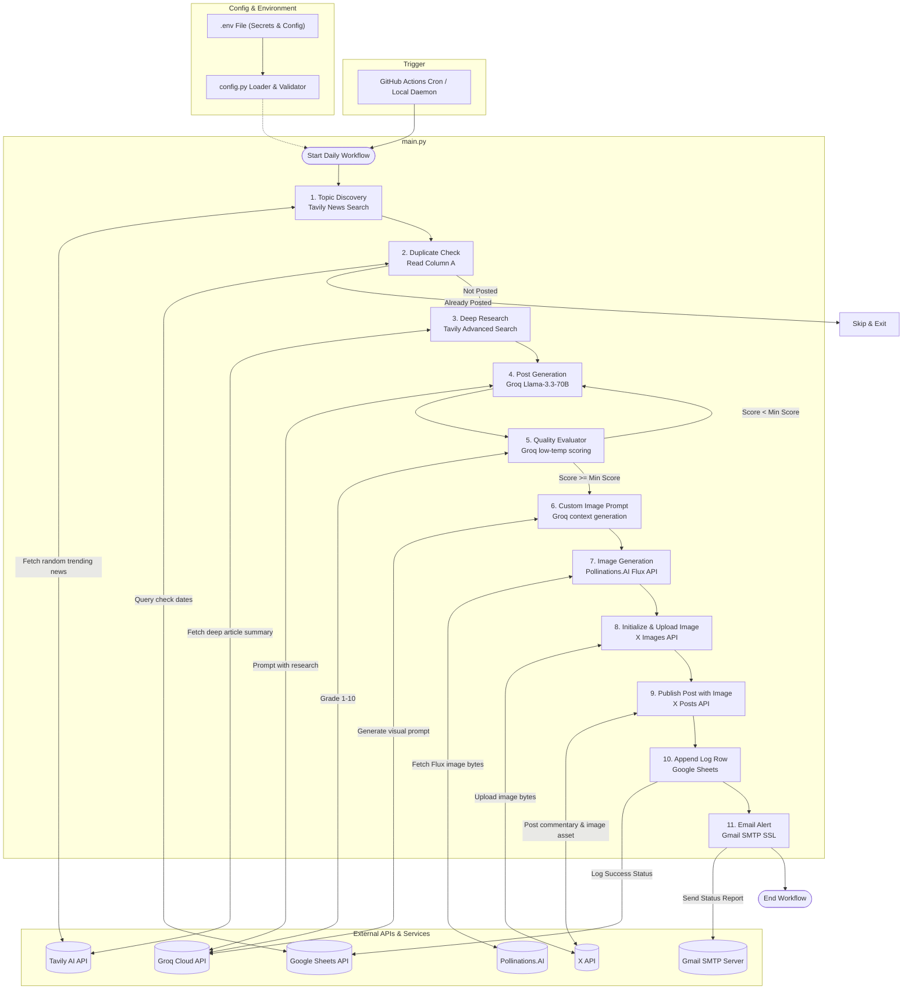

# 🤖 X AI Daily Tweet Automation


[](https://www.python.org/)
[](#license)
[](https://github.com/)
[](#)

A fully automated Python system that discovers trending AI and Big Tech news, researches the topic, writes a polished tweet, generates a matching image, and publishes it to X automatically. The project combines AI generation, automation, logging, and notifications into a reliable daily publishing workflow.

## 🌟 Why This Project Exists

In a world where social media moves fast, keeping a consistent and engaging presence can be time-consuming. This project solves that by automating the full content pipeline: from topic discovery to final publication. It is designed for creators, founders, and developers who want a hands-off way to share high-quality updates with minimal effort.

## 📚 Table of Contents

- [Overview](#overview)
- [Key Features](#key-features)
- [Tech Stack](#tech-stack)
- [Architecture](#architecture)
- [Project Structure](#project-structure)
- [Installation](#installation)
- [Environment Variables](#environment-variables)
- [Usage](#usage)
- [Demo & Screenshots](#demo--screenshots)
- [Roadmap](#roadmap)
- [Contributing](#contributing)
- [License](#license)
- [Acknowledgments](#acknowledgments)

## ✨ Overview

This project automates the daily publishing of AI-themed content to X. It uses modern APIs and AI models to:

- discover relevant and trending news topics,
- research the story in a structured way,
- craft a high-quality tweet under character limits,
- generate a supporting image,
- publish the post to X,
- log results and notify the owner via email.

## 🚀 Key Features

- 🤖 AI-powered tweet generation using Groq
- 🔎 Automated trend discovery with Tavily search
- 🧠 Quality review and retry logic for better output
- 🖼️ Automatic image generation for visual posts
- 🐦 Direct posting to X using Tweepy
- 📊 Duplicate prevention and activity logging in Google Sheets
- 📧 Email alerts for status updates and failures
- ⏰ Scheduled daily execution with configurable timing
- 🛡️ Structured logging for debugging and monitoring

## 🛠️ Tech Stack

- Python 3.11+
- Requests
- Tweepy
- gspread
- schedule
- python-dotenv
- Pillow
- Groq API
- Tavily API
- Pollinations.AI
- Google Sheets API
- Gmail SMTP

## 🧩 Architecture



## 📁 Project Structure

```text
x-auto-tweet-project/
├── x-automation/
│   ├── main.py
│   ├── config.py
│   ├── requirements.txt
│   ├── credentials/
│   └── logs/
├── README.md
├── PRD.md
├── TECH_STACK.md
├── FRONTEND_GUIDELINES.md
└── rules.md
```

## ⚙️ Installation

### 1. Clone the repository

```bash
git clone <your-repo-url>
cd x-auto-tweet-project
```

### 2. Create a virtual environment

```bash
python -m venv .venv
source .venv/bin/activate
```

### 3. Install dependencies

```bash
cd x-automation
pip install -r requirements.txt
```

### 4. Configure your environment

Create a `.env` file in the project root or inside the `x-automation` folder with your credentials.

## 🔐 Environment Variables

Example configuration:

```env
GROQ_API_KEY=your_groq_api_key
TAVILY_API_KEY=your_tavily_api_key
POLLINATIONS_API_KEY=your_pollinations_api_key
GOOGLE_SHEET_ID=your_google_sheet_id
GMAIL_SENDER=your_email@gmail.com
GMAIL_RECEIVER=recipient_email@gmail.com
GMAIL_APP_PASSWORD=your_gmail_app_password
X_API_KEY=your_x_api_key
X_API_KEY_SECRET=your_x_api_key_secret
X_ACCESS_TOKEN=your_x_access_token
X_ACCESS_TOKEN_SECRET=your_x_access_token_secret
```

## ▶️ Usage

Run the automation locally:

```bash
cd x-automation
python main.py
```

Run immediately without waiting for the scheduled time:

```bash
python main.py --now
```

Or set the environment variable:

```bash
RUN_NOW=true python main.py
```

### API / Integration Notes

This project does not expose a public REST API. It is designed as a self-hosted automation workflow that integrates with:

- Groq for content generation
- Tavily for research
- Pollinations.AI for image generation
- X API via Tweepy
- Google Sheets and Gmail for tracking and notifications

## 🖼️ Demo & Screenshots

Placeholder for screenshots or demo links:

- Demo link: https://your-demo-link.com
- Screenshot 1: Add a screenshot of the workflow output
- Screenshot 2: Add a screenshot of the posted tweet or dashboard

## 🗺️ Roadmap

Planned improvements include:

- Support for multiple social platforms
- Better content personalization and tone controls
- A web dashboard for monitoring runs
- Improved retry and error recovery
- Scheduled posting across time zones
- Docker deployment support

## 🤝 Contributing

Contributions are welcome.

1. Fork the repository
2. Create a feature branch
3. Commit your changes
4. Open a pull request

Please keep changes clean, documented, and aligned with the project goals.

## 📄 License

This project is licensed under the MIT License. See the LICENSE file for details.

## 🙏 Acknowledgments

Special thanks to the developers and communities behind:

- Python
- Groq
- Tavily
- Tweepy
- Pollinations.AI
- Google Sheets API

## 👤 Contributors

- Avijit (Maintainer)
- Open to community contributions

